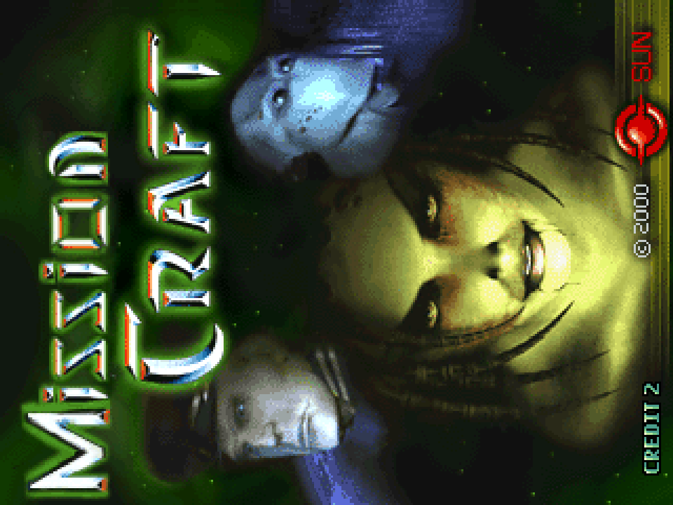
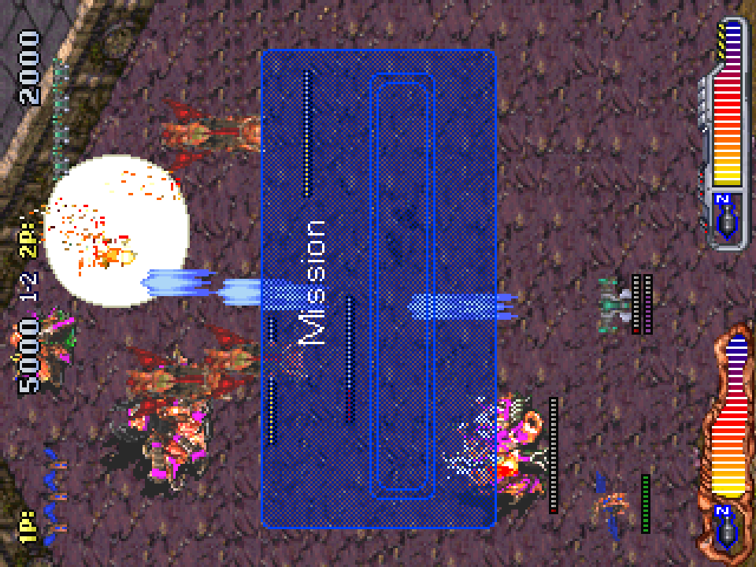
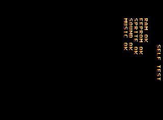

# Vamphalf core for MiSTer

A MiSTer FPGA core for the Hyperstone E1-based arcade boards of MAME's `vamphalf` driver (Danbi /
F2 System, SemiCom, Sun, Omega System, Logic), built with Quartus Prime 17.0.2 Lite for the DE10-nano.

**Status: work in progress, no release yet. 27 sets: Mission Craft and Wivern Wings have been played
on the board; the other 22 boot in simulation in step with MAME and are deployed to the board, not yet
played.**

## Contents

- [History](#history)
- [Games](#games)
  - [Supported](#supported)
  - [Not yet](#not-yet)
  - [Out of scope for now](#out-of-scope-for-now)
- [Hardware](#hardware)
  - [Video timing](#video-timing)
- [Screenshots](#screenshots)
- [Installation](#installation)
- [Controls](#controls)
- [Status](#status)
  - [Features](#features)
  - [Todo](#todo)
  - [Resource usage](#resource-usage)
- [AI Attestation](#ai-attestation)
- [Verification](#verification)
- [Acknowledgements](#acknowledgements)
- [Layout](#layout)
- [License](#license)

## History

No release yet. Development builds that ran on the board:

* `3b95386` (Vamphalf_stp, seed 7): 27 sets deployed; the QS1000's mix balance set from a recording of a
  Mission Craft PCB.
* `4e12daf` onwards: QS1000 sound on Mission Craft and Wivern Wings.
* `eb2dc6a` (Vamphalf_stp): Mission Craft runs on the board.

## Games

The driver's boards share one video system (a banded sprite list, one sprite layer, a 15-bit palette) and
differ in the CPU's bus width, the sound board and the I/O map. The core takes three of them: the E1-16
(GMS30C2116 / E1-16T) board with a QS1000 sound board (Mission Craft), the E1-32 board with a QS1000
(Wivern Wings), and the E1-16 board with a YM2151 and an OKI M6295 (the other 22 sets, in six I/O map
families). A 32 MB SDRAM module holds every set (the largest image is 24 MB; work RAM sits above it).

### Supported

Sets with an `.mra` in `releases/`. Mission Craft and Wivern Wings have been played on the board; the
others have run on the board only as far as being deployed. "MAME trace" is how many instructions of
MAME's trace from reset the whole board (`sim/sys_tb`) retires identically.

| Name | Year | Manufacturer | Set | Board | MAME trace | Notes |
|-|-|-|-|-|-|-|
| Mission Craft (version 2.7) | 2000 | Sun | `misncrft` | E1-16, QS1000 | 1,000,000 of 1,000,000 | Played on the board |
| Mission Craft (version 2.4) | 2000 | Sun | `misncrfta` | E1-16, QS1000 | | Clone of `misncrft` |
| Wivern Wings | 2001 | SemiCom | `wivernwg` | E1-32, QS1000 | 8,000,000 (CPU bench) | Played on the board |
| Wyvern Wings (set 1) | 2001 | SemiCom (Game Vision license) | `wyvernwg` | E1-32, QS1000 | | Clone of `wivernwg` |
| Wyvern Wings (set 2) | 2001 | SemiCom (Game Vision license) | `wyvernwga` | E1-32, QS1000 | | Clone of `wivernwg` |
| Vamf x1/2 (Europe, version 1.1.0908) | 1999 | Danbi / F2 System | `vamphalf` | E1-16, YM2151 + M6295 | 893,119, then the YM2151's busy flag is polled a different number of times | |
| Vamf x1/2 (Europe, version 1.0.0903) | 1999 | Danbi / F2 System | `vamphalfr1` | E1-16, YM2151 + M6295 | | Clone of `vamphalf` |
| Vamp x1/2 (Korea, version 1.1.0908) | 1999 | Danbi / F2 System | `vamphalfk` | E1-16, YM2151 + M6295 | | Clone of `vamphalf` |
| Cool Minigame Collection | 1999 | SemiCom | `coolmini` | E1-16, YM2151 + M6295 | 1,000,000 of 1,000,000 | |
| Cool Minigame Collection (Italy) | 1999 | SemiCom | `coolminii` | E1-16, YM2151 + M6295 | | Clone of `coolmini` |
| Date Quiz Go Go Episode 2 | 2000 | SemiCom | `dquizgo2` | E1-16, YM2151 + M6295 | | coolmini's board |
| Toy Land Adventure | 2001 | SemiCom | `toyland` | E1-16, YM2151 + M6295 | | coolmini's board |
| Mr. Kicker (F-E1-16-010 PCB) | 2001 | SemiCom | `mrkicker` | E1-16, YM2151 + M6295 | 1,000,000 of 1,000,000 | |
| Diet Family | 2001 | SemiCom | `dtfamily` | E1-16, YM2151 + M6295 | | mrkicker's board |
| Jumping Break (set 1) | 1999 | F2 System | `jmpbreak` | E1-16, YM2151 + M6295 | 1,000,000 of 1,000,000 | **Slowdown: 13% of frames lost in play (bench)** |
| Jumping Break (set 2) | 1999 | F2 System | `jmpbreaka` | E1-16, YM2151 + M6295 | | Clone of `jmpbreak` |
| Poosho Poosho | 1999 | F2 System | `poosho` | E1-16, YM2151 + M6295 | | jmpbreak's board |
| New Cross Pang (set 1) | 1999 | F2 System | `newxpang` | E1-16, YM2151 + M6295 | | mrdig's board. **Slowdown: 15% of frames lost in play (bench)** |
| New Cross Pang (set 2) | 1999 | F2 System | `newxpanga` | E1-16, YM2151 + M6295 | | Clone of `newxpang` (jmpbreak's board) |
| Mr. Dig | 2000 | Sun | `mrdig` | E1-16, YM2151 + M6295 | 1,000,000 of 1,000,000 | |
| Super Lup Lup Puzzle / Zhuan Zhuan Puzzle (version 4.0 / 990518) | 1999 | Omega System | `suplup` | E1-16, YM2151 + M6295 | 1,000,000 of 1,000,000 | Runs 2.2% slow (pixel clock) |
| Lup Lup Puzzle / Zhuan Zhuan Puzzle (version 3.0 / 990128) | 1999 | Omega System | `luplup` | E1-16, YM2151 + M6295 | | Clone of `suplup` |
| Lup Lup Puzzle / Zhuan Zhuan Puzzle (version 2.9 / 990108) | 1999 | Omega System | `luplup29` | E1-16, YM2151 + M6295 | | Clone of `suplup` |
| Lup Lup Puzzle / Zhuan Zhuan Puzzle (version 1.05 / 981214) | 1999 | Omega System (Adko license) | `luplup10` | E1-16, YM2151 + M6295 | | Clone of `suplup` |
| Puzzle Bang Bang (Korea, version 2.9 / 990108) | 1999 | Omega System | `puzlbang` | E1-16, YM2151 + M6295 | | Clone of `suplup` |
| Puzzle Bang Bang (Korea, version 2.8 / 990106) | 1999 | Omega System | `puzlbanga` | E1-16, YM2151 + M6295 | | Clone of `suplup` |
| World Adventure | 1999 | Logic / F2 System | `worldadv` | E1-16, YM2151 + M6295 | 1,000,000 of 1,000,000 | FPGA protection: MAME's seven checks replayed, 0 differ |

### Not yet

| Name | Why |
|-|-|
| Solitaire (version 2.5) | An 11-button panel: its own joystick layout and keyboard map |
| Final Godori (Korea, version 2.20.5915) | E1-32 with the YM2151 + M6295, and a 32 KB banked backup RAM (32 more block RAMs, and its `.nvm`) |
| Boong-Ga Boong-Ga (Spank'em!) | 28 MB of graphics, past the core's 16 MB graphics space; a 17-bit sprite code; sensor inputs |
| Age Of Heroes - Silkroad 2 | An E1-32XN CPU at 80 MHz, its own sprite format and screen, 64 MB of graphics |

### Out of scope for now

| MAME description | Why |
|-|-|
| Mr. Kicker (SEMICOM-003b PCB) | MACHINE_NOT_WORKING in MAME (the EEPROM corrupts) |
| Yori Jori Kuk Kuk | MACHINE_NOT_WORKING in MAME (MAME patches the program to boot) |

## Hardware

| Chip | Function | Status |
|-|-|-|
| Hyperstone E1-16T / GMS30C2116, E1-32T, 50 MHz | Main CPU | Written here (`rtl/e1/e1_cpu.sv`) from MAME's `e132xs`. Multi-cycle, about 5 clk_sys per instruction behind 16 KB I- and 4 KB D-caches (`rtl/vh_cpumem.sv`) |
| Sprites and palette | Video | Written here (`rtl/video/vh_video.sv`): rendered per scanline from a snapshot of the sprite list |
| QS1000 (8052 + 32-voice wavetable) | Sound, QS1000 boards | 8052: jotego's JT8051, changed (`rtl/qs1000/PROVENANCE.md`); wavetable written here from MAME's `qs1000.cpp` (`rtl/qs1000/vh_qs1000_voice.sv`) |
| YM2151 | FM sound | jotego's JT51, vendored (`rtl/sound/PROVENANCE.md`) |
| OKI M6295 | ADPCM sound | jotego's JT6295, with the Fuuki core's ROM bridge and sample cache |
| 93C46 | Settings EEPROM | From Arcade-KonamiGX_MiSTer |
| Actel A40MX04 (two per board) | Protection: Mission Craft, Wivern Wings, World Adventure | MAME's lookup tables (`vamphalf_prot.cpp`): `rtl/vh_prot.sv`, `rtl/vh_prot_wa.sv` |

### Video timing

28 MHz / 4 = 7 MHz dot clock, 448 dots by 264 lines: 15.625 kHz lines, 59.19 Hz frames. Visible 320 x 236
(dots 31 to 350, lines 16 to 251). Source: MAME's `set_raw` (`vamphalf.cpp:156-161`, `:1150`). The SUPLUP
board's dot clock is 14.318181 MHz / 2 = 7.159 MHz (60.53 Hz, `:1251`); the core runs it at 7 MHz
(`docs/HACKS.md`).

## Screenshots

### Mission Craft (from the board)

### Wivern Wings (from the board, native resolution)

## Installation

A 32 MB SDRAM module is required.

There is no release `.rbf` in `releases/` yet. When there is:

* Take the latest `*.rbf` from `releases/` and put it in `_Arcade/cores`, renamed to drop the
  `Arcade-` prefix (`Arcade-Vamphalf_YYYYMMDD.rbf` becomes `Vamphalf_YYYYMMDD.rbf`). MiSTer launches
  the highest-sorting match for `<rbf>Vamphalf</rbf>`, and a `Vamphalf_*.rbf` sorts above every
  `Arcade-Vamphalf_*.rbf`
* Take the `*.mra` files and the `_alternatives` folder from `releases/` and put them in `_Arcade`
  (or a subdirectory starting with an underscore, e.g. `_Arcade/_Vamphalf`)
* Put the MAME merged or split ROM sets in `games/mame`

To run a development build instead: `python scripts/build_staged.py`, then `python scripts/deploy.py`
with a `mister.env` (see `scripts/deploy.py`).

## Controls

Pad: Button 1-4, Start, Coin, Pause, Service (the `.mra` names Wivern Wings' Shot, Defense and Bomb).
Pause suspends the main CPU. The games keep their settings in the EEPROM: the service switch (F2, or the
OSD's Service Mode) opens each game's test menu.

Keyboard, MAME's defaults: arrows / R F D G, buttons LCtrl LAlt Space LShift / A S Q W, Start 1 / 2,
Coin 5 / 6; F2 service switch, 9 service coin, P pause.

## Status

Known issues:

* **The CPU is slower than the board's.** The E1 here takes about 5 clocks of 56 MHz per instruction
  where the chip, in MAME's model, takes about one at 50 MHz. Mission Craft, Wivern Wings, Super Lup Lup
  Puzzle and Mr. Dig never miss a frame in play on the bench; Jumping Break and New Cross Pang lose 13 and
  15% of frames in play, and Cool Minigame Collection, Toy Land, Mr. Kicker, Diet Family and World
  Adventure lose frames in bursts (`scripts/speed_survey.py`, 1,300 frames each). Next in the roadmap.
* The QS1000 has no envelopes, filter or looping (as MAME): a held note stops at its loop end. Its balance
  of ADPCM against PCM voices is taken from a recording of a Mission Craft PCB instead of MAME's (effects
  18 dB higher against the music, `docs/MAME_KLUDGES.md`).
* The SUPLUP board's games run 2.2% slow (pixel clock).
* Flip screen and the `.nvm` save and restore have not been checked on the board.

`docs/MAME_KLUDGES.md` lists what is taken from MAME as behaviour and what is known not to be
right. `docs/HACKS.md` lists this core's own approximations. `docs/ROADMAP.md` is the plan and its
progress; `docs/LESSONS_LEARNED.md` is what it cost.

### Features

* DIP switches from the `.mra` (`DIP;` in the OSD): n/a, the boards have none; settings live in the EEPROM
* Inputs: done; pad and MAME's default keys
* CRT Adjust (H-Position, V-Shift, H-Size, V-Size): H-Size, H-Position and V-Shift; no V-Size
* HDMI scaling (integer scale, crop, crop offset): integer scale modes; no crop
* HDMI rotation (orientation): done; Auto follows each set's orientation
* Flip screen, HDMI and analog, from the OSD or the DIP (fake DIP where the game has none): OSD Flip
  Screen through the video engine; not yet checked on the board against the unflipped frame turned 180
  degrees
* HDMI-only options hidden under direct video: not yet
* Peripheral menus shown only for games that use them: n/a
* Rotary joysticks (Ikari Warriors controls, GRS keystroke mode), where used: n/a
* Light guns: mouse, analog stick and synthetic crosshair, where used: n/a
* Audio mix (Mono, None, 25%, 50%): done (Stereo Mix)
* Hiscore saving (`hiscore.v`, with autosave): not yet
* NVRAM / EEPROM saved to the `.nvm` file: in place, not yet checked on the board
* Fast ROM loading via DDR: not yet
* Pause (with CPU suspended): done
* Sound: done (QS1000; YM2151 + M6295)
* Savestates (optional): not yet; state inventory in `docs/STATE.md`
* Cheats (optional): not yet

### Todo

- [ ] CPU speed: a deeper instruction lookahead in the fetch path, then a pipelined E1 if that is not enough
- [ ] Video frames against MAME for the 22 new sets (the colour shift of the SUPLUP board is unchecked)
- [ ] Flip screen and `.nvm` checks on the board; a release build
- [ ] Solitaire, Final Godori

### Resource usage

The debug revision (`Vamphalf_stp`, commit `3b95386`, seed 7) on the DE10-nano's Cyclone V 5CSEBA6, speed
grade 7, every clock meeting timing (clk_sys +0.531 ns):

| resource | used | available |
| --- | --- | --- |
| Logic (ALMs) | 29,728 | 41,910 |
| Block memory bits | 3,862,637 | 5,662,720 |
| RAM blocks | 521 | 553 |
| DSP blocks | 47 | 112 |
| PLLs | 3 | 6 |

RAM blocks are the one to watch: 94% in the debug revision. The release revision has not been built.

## AI Attestation

This core is being developed with heavy use of a frontier coding assistant.

What the assistant is held to, and what shows in the repository:

* Hardware facts come from MAME's `vamphalf.cpp`, `vamphalf_prot.cpp`, `qs1000.cpp` and `e132xs`. Every
  ROM layout, register map and timing constant is traced to a line of source or a measurement.
* Claims are checked before they are written down: the CPU and the whole board against MAME's
  instruction traces, the video against MAME's frames, the sound against MAME's audio and register
  writes, and each `.mra` image against MAME's ROM_START.
* Where the hardware is known to differ from MAME, the evidence is recorded: the QS1000's mix balance
  comes from a PCB recording of Mission Craft (https://www.youtube.com/watch?v=ur5dur6w9L4).
* Where the reference and the hardware disagree, or where MAME's own comments disclaim accuracy, that is
  recorded in `docs/MAME_KLUDGES.md` and `docs/HACKS.md` rather than silently resolved.

`docs/LESSONS_LEARNED.md` carries the accumulated rules from the Psikyo, Fuuki, Seta, MegaSystem 32 and
KonamiGX projects, and this core.

## Verification

Not PCB-validated. MAME is the accuracy reference, with its own acknowledged uncertainties noted
where they matter.

* CPU: `rtl/e1/e1_cpu.sv` agrees with MAME's interpreter after every instruction (PC, SR, all registers,
  every bus access) on Mission Craft's first 1,000,000 instructions, Wivern Wings' first 8,000,000 (E1-32)
  and the random conformance suite (`scripts/e1_regress.py`, 255 of 255 primary opcodes).
* Whole board (`sim/sys_tb`, real SDRAM controller and a chip model) against MAME's trace from reset:
  1,000,000 of 1,000,000 instructions on `misncrft`, `coolmini`, `mrkicker`, `jmpbreak`, `mrdig`,
  `suplup` and `worldadv`; 893,119 on `vamphalf`.
* Board against bench: the architectural trace (`rtl/debug/vh_trace.sv`) of Mission Craft's boot read back
  from the board equals the bench's in every category.
* Video: the line engine renders 38 of 38 frames per set pixel-identical to a model of MAME's
  `draw_sprites`, which is pixel-identical to MAME on 342 of 342 captured frames of `misncrft` and of
  `wivernwg`.
* `.mra`: every set's image is identical to MAME's ROM_START image (`scripts/build_mra.py`).
* QS1000: the 8052 with the board's memories agrees with MAME's trace for 3,000,000 instructions per set
  (`sim/qs1000_tb`); the wavetable engine equals a transcription of MAME's on every tick, 3,000,000 per
  set alone (`sim/qs1000v_tb`) and 6.9M and 7.0M in the whole board in play, where the 8052's register
  writes equal MAME's.
* YM2151 + M6295 against MAME's audio of `vamphalf`: correlation 0.971, RMS ratio 1.008.
* Protection: Mission Craft's power-on check, 90 of 90 accesses as MAME; World Adventure's seven checks of
  a 2-hour MAME run, 0 differences.

## Acknowledgements

- **Sorgelig** and the **MiSTer-devel team** for the
  [Template_MiSTer](https://github.com/MiSTer-devel/Template_MiSTer) framework, and Sorgelig's
  `sdram.v`, here by way of the Psikyo, Fuuki and KonamiGX cores.
- The **MAMEdev team** — Angelo Salese, David Haywood, Pierpaolo Prazzoli and Tomasz Slanina
  (`vamphalf.cpp`), Philip Bennett (`qs1000.cpp`), Pierpaolo Prazzoli (`e132xs`) — for the driver and
  device emulations that are this core's specification.
- **Jose Tejada (jotego)** for JT8051, JT51 and JT6295 ([jtcores](https://github.com/jotego/jtcores)).
- **Umberto Parisi (rmonic79)** for `crt_adjust.sv`, from Arcade-Raiden_MiSTer by way of the Fuuki core.

## Layout

Standard [Template_MiSTer](https://github.com/MiSTer-devel/Template_MiSTer) structure:

| path | contents |
| - | - |
| `sys` | MiSTer framework, vendored from the template, never edited |
| `rtl` | core source; vendored modules carry a `PROVENANCE.md` |
| `releases` | `.rbf` and `.mra` files; clones in `_alternatives` |
| `docs` | roadmap, workflow, release process, kludges, hacks, lessons |
| `sim` | ModelSim and Verilator testbenches |
| `scripts` | build, deploy, capture and verification tooling |
| `debug` | reference captures from MAME used as ground truth (gitignored) |
| `roms` | your own MAME sets (gitignored, never committed) |

## License

GPL-3.0 (see `LICENSE`). Imported components keep their own licences; the `PROVENANCE.md` file beside
each vendored directory has the detail, and every modified vendored file states the change in its header.

Game ROMs contain copyrighted material and are not included. Obtaining them is your
responsibility.
