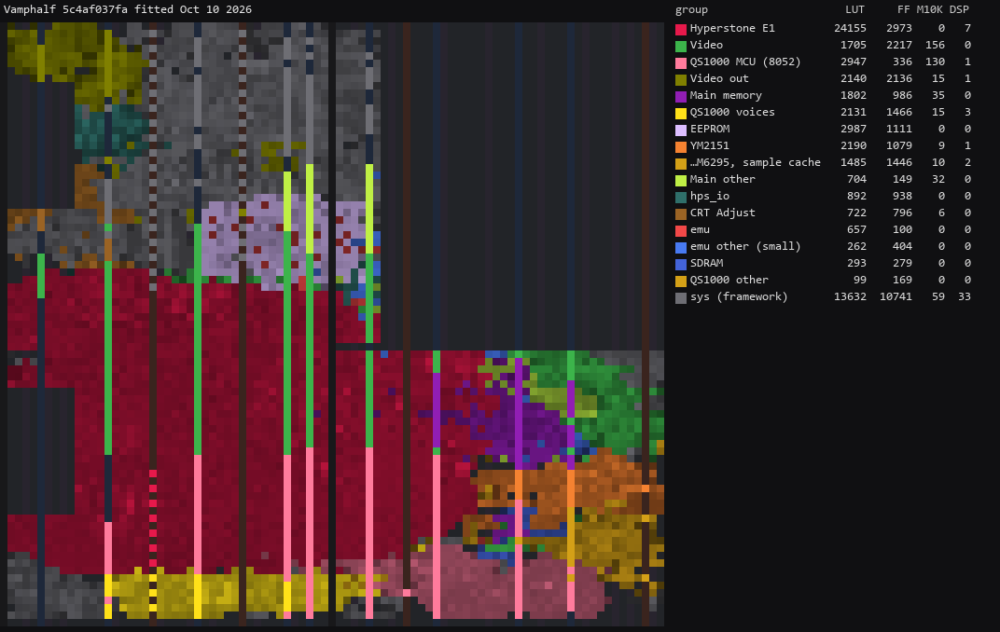

# Vamphalf core for MiSTer

A MiSTer FPGA core for the Hyperstone E1-based arcade boards of MAME's `vamphalf` driver (Danbi /
F2 System, SemiCom, Sun, Omega System, Logic), built with Quartus Prime 17.0.2 Lite for the DE10-nano.

**Status: work in progress. Some games lose a small number of frames that do not complete in time.
Boong-Ga Boong-Ga needs the 128 MB SDRAM module.**

## Contents

- [History](#history)
- [Games](#games)
  - [Supported](#supported)
  - [Not yet](#not-yet)
- [Hardware](#hardware)
  - [Video timing](#video-timing)
  - [Floorplan](#floorplan)
- [Installation](#installation)
- [Controls](#controls)
- [Status](#status)
  - [Todo](#todo)
  - [Resource usage](#resource-usage)
- [AI Attestation](#ai-attestation)
- [Verification](#verification)
- [Acknowledgements](#acknowledgements)
- [Layout](#layout)
- [License](#license)

## History

* **20261009** (`releases/Arcade-Vamphalf_20261009.rbf`)
  * New sets: Mr. Kicker (SEMICOM-003b PCB), Boong-Ga Boong-Ga (128 MB SDRAM), Solitaire, Final Godori,
    Yori Jori Kuk Kuk
  * CPU: SETADR fix, which stops Mr. Kicker (SEMICOM-003b PCB) hanging when it rewrites its EEPROM
  * Service Mode is a held pad input, as on the board
* **20261008** (`releases/Arcade-Vamphalf_20261008.rbf`)
  * Initial release
  * QS1000 sound: the level of the effects against the music set from a PCB recording, not MAME's
  * A few games suffer a little slowdown/dropped frames, will continue to work on it
  * Fast ROM loading
  * CRT Adjust
  * Flip screen, HDMI rotation
  * MAME's default keyboard mapping

## Games

The supported sets run on four boards: the E1-16 (GMS30C2116 / E1-16T) board with a QS1000 sound board
(Mission Craft), the E1-32 board with a QS1000 (Wivern Wings, Yori Jori Kuk Kuk), the E1-16 board with a YM2151 and an
OKI M6295 (24 sets, in nine I/O map families), and the E1-32 board with the YM2151 and a banked M6295
(Mr. Kicker, SEMICOM-003b PCB; Final Godori, with a 32 KB backup RAM). All four have the same video: one layer of
16x16 sprites from a list in sprite RAM, and a 15-bit palette.

### Supported

| Name | Year | Manufacturer | Set | Board | MAME trace | Notes |
|-|-|-|-|-|-|-|
| Mission Craft (version 2.7) | 2000 | Sun | `misncrft` | E1-16, QS1000 | 1,000,000 of 1,000,000 | |
| Mission Craft (version 2.4) | 2000 | Sun | `misncrfta` | E1-16, QS1000 | | Clone of `misncrft` |
| Wivern Wings | 2001 | SemiCom | `wivernwg` | E1-32, QS1000 | 8,000,000 (CPU bench) | |
| Wyvern Wings (set 1) | 2001 | SemiCom (Game Vision license) | `wyvernwg` | E1-32, QS1000 | | Clone of `wivernwg` |
| Wyvern Wings (set 2) | 2001 | SemiCom (Game Vision license) | `wyvernwga` | E1-32, QS1000 | | Clone of `wivernwg` |
| Yori Jori Kuk Kuk | 2002 | Golden Bell Entertainment | `yorijori` | E1-32, QS1000 | 439,730, then the timer interrupt's timing differs | MACHINE_NOT_WORKING in MAME, which patches the program to boot; with the SETADR fix it boots unpatched (Verification) |
| Vamf x1/2 (Europe, version 1.1.0908) | 1999 | Danbi / F2 System | `vamphalf` | E1-16, YM2151 + M6295 | 893,119, then the YM2151's busy flag is polled a different number of times | |
| Vamf x1/2 (Europe, version 1.0.0903) | 1999 | Danbi / F2 System | `vamphalfr1` | E1-16, YM2151 + M6295 | | Clone of `vamphalf` |
| Vamp x1/2 (Korea, version 1.1.0908) | 1999 | Danbi / F2 System | `vamphalfk` | E1-16, YM2151 + M6295 | | Clone of `vamphalf` |
| Cool Minigame Collection | 1999 | SemiCom | `coolmini` | E1-16, YM2151 + M6295 | 1,000,000 of 1,000,000 | |
| Cool Minigame Collection (Italy) | 1999 | SemiCom | `coolminii` | E1-16, YM2151 + M6295 | | Clone of `coolmini` |
| Date Quiz Go Go Episode 2 | 2000 | SemiCom | `dquizgo2` | E1-16, YM2151 + M6295 | | coolmini's board |
| Toy Land Adventure | 2001 | SemiCom | `toyland` | E1-16, YM2151 + M6295 | | coolmini's board |
| Mr. Kicker (F-E1-16-010 PCB) | 2001 | SemiCom | `mrkicker` | E1-16, YM2151 + M6295 | 1,000,000 of 1,000,000 | |
| Mr. Kicker (SEMICOM-003b PCB) | 2001 | SemiCom | `mrkickera` | E1-32, YM2151 + M6295 | 1,000,000 of 1,000,000 | Clone of `mrkicker`. MACHINE_NOT_WORKING in MAME, which hangs when the game rewrites its EEPROM; the core fixes the CPU fault behind it (Verification) |
| Diet Family | 2001 | SemiCom | `dtfamily` | E1-16, YM2151 + M6295 | | mrkicker's board |
| Jumping Break (set 1) | 1999 | F2 System | `jmpbreak` | E1-16, YM2151 + M6295 | 1,000,000 of 1,000,000 | |
| Jumping Break (set 2) | 1999 | F2 System | `jmpbreaka` | E1-16, YM2151 + M6295 | | Clone of `jmpbreak` |
| Poosho Poosho | 1999 | F2 System | `poosho` | E1-16, YM2151 + M6295 | | jmpbreak's board |
| New Cross Pang (set 1) | 1999 | F2 System | `newxpang` | E1-16, YM2151 + M6295 | | mrdig's board |
| New Cross Pang (set 2) | 1999 | F2 System | `newxpanga` | E1-16, YM2151 + M6295 | | Clone of `newxpang` (jmpbreak's board) |
| Mr. Dig | 2000 | Sun | `mrdig` | E1-16, YM2151 + M6295 | 1,000,000 of 1,000,000 | |
| Super Lup Lup Puzzle / Zhuan Zhuan Puzzle (version 4.0 / 990518) | 1999 | Omega System | `suplup` | E1-16, YM2151 + M6295 | 1,000,000 of 1,000,000 | |
| Lup Lup Puzzle / Zhuan Zhuan Puzzle (version 3.0 / 990128) | 1999 | Omega System | `luplup` | E1-16, YM2151 + M6295 | | Clone of `suplup` |
| Lup Lup Puzzle / Zhuan Zhuan Puzzle (version 2.9 / 990108) | 1999 | Omega System | `luplup29` | E1-16, YM2151 + M6295 | | Clone of `suplup` |
| Lup Lup Puzzle / Zhuan Zhuan Puzzle (version 1.05 / 981214) | 1999 | Omega System (Adko license) | `luplup10` | E1-16, YM2151 + M6295 | | Clone of `suplup` |
| Puzzle Bang Bang (Korea, version 2.9 / 990108) | 1999 | Omega System | `puzlbang` | E1-16, YM2151 + M6295 | | Clone of `suplup` |
| Puzzle Bang Bang (Korea, version 2.8 / 990106) | 1999 | Omega System | `puzlbanga` | E1-16, YM2151 + M6295 | | Clone of `suplup` |
| World Adventure | 1999 | Logic / F2 System | `worldadv` | E1-16, YM2151 + M6295 | 1,000,000 of 1,000,000 | Protection: MAME's seven checks replayed, 0 differ |
| Solitaire (version 2.5) | 1999 | F2 System | `solitaire` | E1-16, YM2151 + M6295 | 869,671, then a YM2151 status read differs (busy in MAME) | Eleven buttons (Controls) |
| Final Godori (Korea, version 2.20.5915) | 2001 | SemiCom | `finalgdr` | E1-32, YM2151 + banked M6295 | 1,000,000 of 1,000,000 | 32 KB backup RAM, saved in the `.nvm` after the EEPROM |
| Boong-Ga Boong-Ga (Spank'em!) | 2001 | Taff System | `boonggab` | E1-16, YM2151 + banked M6295 | 1,000,000 of 1,000,000 | Needs the 128 MB SDRAM module (28 MB of graphics). Four buttons give four of the photo sensors' seven hit strengths (`docs/HACKS.md`) |

### Not yet

| Name | Why |
|-|-|
| Age Of Heroes - Silkroad 2 | An E1-32XN CPU at 80 MHz, its own sprite format and screen, 64 MB of graphics |

## Hardware

| Chip | Function | Status |
|-|-|-|
| Hyperstone E1-16T / GMS30C2116, E1-32T, 50 MHz | Main CPU | Written here (`rtl/e1/e1_cpu.sv`) from MAME's `e132xs`, multi-cycle, behind a 16 KB I-cache and a 4 KB D-cache (`rtl/vh_cpumem.sv`) |
| Sprites and palette | Video | Written here (`rtl/video/vh_video.sv`): rendered per scanline from a copy of the sprite list taken once a frame |
| QS1000 (8052 + 32-voice wavetable) | Sound, QS1000 boards | 8052: jotego's JT8051, changed (`rtl/qs1000/PROVENANCE.md`); wavetable written here from MAME's `qs1000.cpp` (`rtl/qs1000/vh_qs1000_voice.sv`) |
| YM2151 | FM sound | jotego's JT51 (`rtl/sound/PROVENANCE.md`) |
| OKI M6295 | ADPCM sound | jotego's JT6295, with the Fuuki core's ROM bridge and sample cache |
| 93C46 | Settings EEPROM | From Arcade-KonamiGX_MiSTer |
| Protection | Mission Craft, Wivern Wings, World Adventure | MAME's tables (`vamphalf_prot.cpp`): `rtl/vh_prot.sv`, `rtl/vh_prot_wa.sv` |

### Video timing

28 MHz / 4 = 7 MHz dot clock, 448 dots by 264 lines: 15.625 kHz lines, 59.19 Hz frames. Visible 320 x 236
(dots 31 to 350, lines 16 to 251). Source: MAME's `set_raw` (`vamphalf.cpp:156-161`, `:1150`). The SUPLUP
board's dot clock is 14.318181 MHz / 2 = 7.159 MHz (60.53 Hz, `:1251`); the core runs it at 7 MHz
(`docs/HACKS.md`).

### Floorplan

Where the logic sits on the Cyclone V, read from the compiled design with `scripts/floorplan.py` (blocks defined in `scripts/floorplan.json`). One cell per LAB, M10K or DSP site, coloured by the block owning most of it, brighter when fuller. The thin columns are M10K and DSP; the empty area at the top right is the HPS; grey is the MiSTer framework. LUT counts are combinational cells, two per ALM.

Revision `Vamphalf`, fitted 08 Oct 2026:

## Installation

A 32 MB SDRAM module is required (the images are up to 24 MB; work RAM sits above them). Boong-Ga
Boong-Ga needs the 128 MB module: its graphics from 16 MB up are stored above the 32 MB line.

* Take the latest `*.rbf` from `releases/` and put it in `_Arcade/cores`, renamed to drop the
  `Arcade-` prefix (`Arcade-Vamphalf_YYYYMMDD.rbf` becomes `Vamphalf_YYYYMMDD.rbf`)
* Put the `*.mra` files and the `_alternatives` folder from `releases/` in `_Arcade` (or a subdirectory
  starting with an underscore, e.g. `_Arcade/_Vamphalf`)
* Put the MAME merged or split ROM sets in `games/mame`

To build and deploy a development build: `python scripts/build_staged.py`, then `python scripts/deploy.py`
with a `mister.env` (see `scripts/deploy.py`).

## Controls

Pad: Button 1-4, Start, Coin, Pause, Service Coin, Service Mode (the `.mra` names Wivern Wings' Shot,
Defense and Bomb, and Boong-Ga Boong-Ga's four hit strengths). Pause suspends the main CPU. MAME gives the boards no DIP switches; Service Mode is the
test switch, momentary as in MAME (held, not toggled), and has no default pad button.

Keyboard, MAME's defaults: arrows / R F D G, buttons LCtrl LAlt Space LShift / A S Q W, Start 1 / 2,
Coin 5 / 6; F2 service switch, 9 service coin, P pause.

Solitaire has eleven buttons, with MAME's names: Column 1-7, Turn Up Card, Select Turned Up Card, Register
and Gift. In the pad's mapping list, Column 5 onwards come after Service Mode. Keys as MAME: Z X C V B N M for
the columns, A S D F for the other four.

## Status

Known issues:

* **The CPU is slower than the original**: some games lose a small number of frames that do not
  complete in time. On the bench (900 frames, coin then play, after commit `ff38ff1`), frames in which
  the game never reached its idle loop: New Cross Pang 30, Toy Land 10, Jumping Break 3, Mission Craft 0.
  The other sets have not been measured since that change.
* The QS1000 follows MAME's model, which has no envelopes, filter or looping.
* The SUPLUP board's games run 2.2% slow (Video timing).
* Not yet checked on the board: flip screen, the `.nvm` save and restore.

`docs/ROADMAP.md` is the plan and its progress.

### Todo

- [ ] CPU speed (`docs/ROADMAP.md`, CPU throughput)
- [ ] Video frames against MAME for the sets other than Mission Craft and Wivern Wings
- [ ] Flip screen and `.nvm` on the board

### Resource usage

The release revision (`Vamphalf`, commit `fe5d6fa`, seed 7) on the DE10-nano's Cyclone V 5CSEBA6, speed
grade 7, every clock meeting timing (clk_sys +0.957 ns):

| resource | used | available |
| --- | --- | --- |
| Logic (ALMs) | 30,225 | 41,910 |
| Block memory bits | 3,310,189 | 5,662,720 |
| RAM blocks | 457 | 553 |
| DSP blocks | 47 | 112 |
| PLLs | 3 | 6 |

## AI Attestation

This core is being developed with heavy use of a frontier coding assistant.

## Verification

MAME's `vamphalf.cpp`, `vamphalf_prot.cpp`, `qs1000.cpp` and `e132xs` are the reference, except for the
QS1000's sound levels, which are set from and checked against a PCB recording, and the E1's SETADR
instruction (both below). Where the core
follows MAME on something MAME marks as uncertain, it is listed in `docs/MAME_KLUDGES.md`; the core's own
approximations are in `docs/HACKS.md`.

* CPU: `rtl/e1/e1_cpu.sv` agrees with MAME's interpreter after every instruction (PC, SR, all registers,
  every bus access), at 0 and 3 bus wait states, on Mission Craft's first 1,000,000 instructions, Wivern
  Wings' first 8,000,000 (E1-32) and the random conformance suite (`scripts/e1_regress.py`, 255 of 255
  primary opcodes).
* Whole board (`sim/sys_tb`, the SDRAM controller and a chip model) against MAME's trace from reset:
  1,000,000 of 1,000,000 instructions on `misncrft`, `coolmini`, `mrkicker`, `mrkickera`, `jmpbreak`, `mrdig`,
  `suplup`, `worldadv`, `boonggab` and `finalgdr`; 893,119 on `vamphalf` and 869,671 on `solitaire`, each
  followed by a YM2151 status read that differs. `finalgdr` from a saved backup RAM: its first 2,091
  backup RAM accesses as MAME's.
* Video: the line engine renders 38 of 38 frames per set pixel-identical to a model of MAME's
  `draw_sprites`, which is pixel-identical to MAME on 342 of 342 captured frames of `misncrft` and of
  `wivernwg`.
* `.mra`: every set's image is identical to MAME's ROM_START image (`scripts/build_mra.py`).
* ROM loading (`sim/top_tb`): the byte path and the fast load both leave SDRAM, the QS1000's u7 and the
  EEPROM identical to the image (or to a `.nvm` loaded after it); `finalgdr`'s backup RAM identical to its
  `.nvm`, and the save path reads every `.nvm` byte back.
* QS1000: the 8052 with the board's memories agrees with MAME's trace for 3,000,000 instructions per set
  (`sim/qs1000_tb`); the wavetable engine equals a transcription of MAME's on every tick, 3,000,000 per
  set alone (`sim/qs1000v_tb`) and 6.9M and 7.0M ticks in the whole board in play, where the 8052's
  register writes equal MAME's.
* QS1000 sound levels against a
  [PCB recording of Mission Craft](https://www.youtube.com/watch?v=ur5dur6w9L4) (1188 s analysed): the
  music is ADPCM, the shot and other effects PCM. The shot peaks at a median -2.9 dB of the recording's
  RMS (range -5.5 to -1.9 dB over 18 one-minute windows); MAME's balance gives -20.3 dB. The core's balance (ADPCM x2, PCM x4: effects 18 dB higher
  against the music than MAME) gives -2.6 dB with the same measurement (`scripts/qs1000_stems.py`,
  `docs/MAME_KLUDGES.md`, Sound).
* SETADR: MAME puts the frame-wrap carry in bit 0 where its original source says bit 9. With MAME's
  version Mr. Kicker (SEMICOM-003b PCB) hangs whenever it rewrites its EEPROM (from blank, or after a
  damaged save), which is why MAME marks it not working; with the carry in bit 9 it rebuilds a blank EEPROM
  to the ROM's defaults and boots (`sim/sys_tb`), and the other sets' traces are unchanged
  (`docs/MAME_KLUDGES.md`, CPU and I/O). MAME's ROM patch for Yori Jori Kuk Kuk works around the same
  fault: with the carry in bit 9, MAME boots it unpatched.
* YM2151 + M6295 against MAME's audio of `vamphalf`: correlation 0.971, RMS ratio 1.008.
* Protection: Mission Craft's power-on check, 90 of 90 accesses as MAME; World Adventure's seven checks of
  a 2-hour MAME run, 0 differences.

## Acknowledgements

- **Sorgelig** and the **MiSTer-devel team** for the
  [Template_MiSTer](https://github.com/MiSTer-devel/Template_MiSTer) framework, and Sorgelig's
  `sdram.v`, here by way of the Psikyo, Fuuki and KonamiGX cores.
- The **MAMEdev team**: Angelo Salese, David Haywood, Pierpaolo Prazzoli and Tomasz Slanina
  (`vamphalf.cpp`), Philip Bennett (`qs1000.cpp`), Pierpaolo Prazzoli (`e132xs`), for the driver and
  device emulations that are this core's specification.
- **Jose Tejada (jotego)** for JT8051, JT51 and JT6295 ([jtcores](https://github.com/jotego/jtcores)).
- **Umberto Parisi (rmonic79)** for `crt_adjust.sv`, from Arcade-Raiden_MiSTer by way of the Fuuki core.

## Layout

Standard [Template_MiSTer](https://github.com/MiSTer-devel/Template_MiSTer) structure:

| path | contents |
| - | - |
| `sys` | MiSTer framework, vendored from the template, never edited |
| `rtl` | core source; vendored modules carry a `PROVENANCE.md` |
| `releases` | `.rbf` and `.mra` files; clones in `_alternatives` |
| `docs` | roadmap, workflow, release process, kludges, hacks, lessons |
| `sim` | ModelSim and Verilator testbenches |
| `scripts` | build, deploy, capture and verification tooling |
| `debug` | reference captures from MAME used as ground truth (gitignored) |
| `roms` | your own MAME sets (gitignored, never committed) |

## License

GPL-3.0 (see `LICENSE`). Imported components keep their own licences; the `PROVENANCE.md` file beside
each vendored directory has the detail.

Game ROMs contain copyrighted material and are not included. Obtaining them is your
responsibility.
